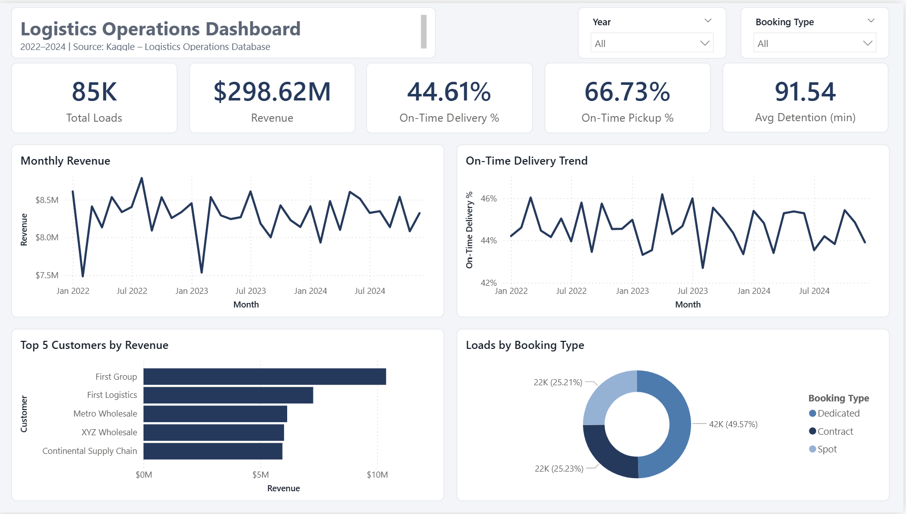
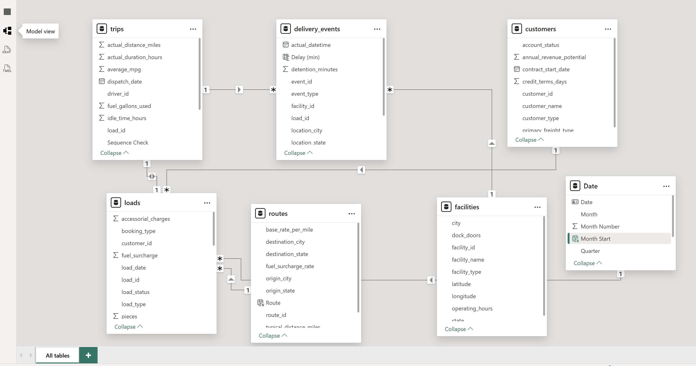
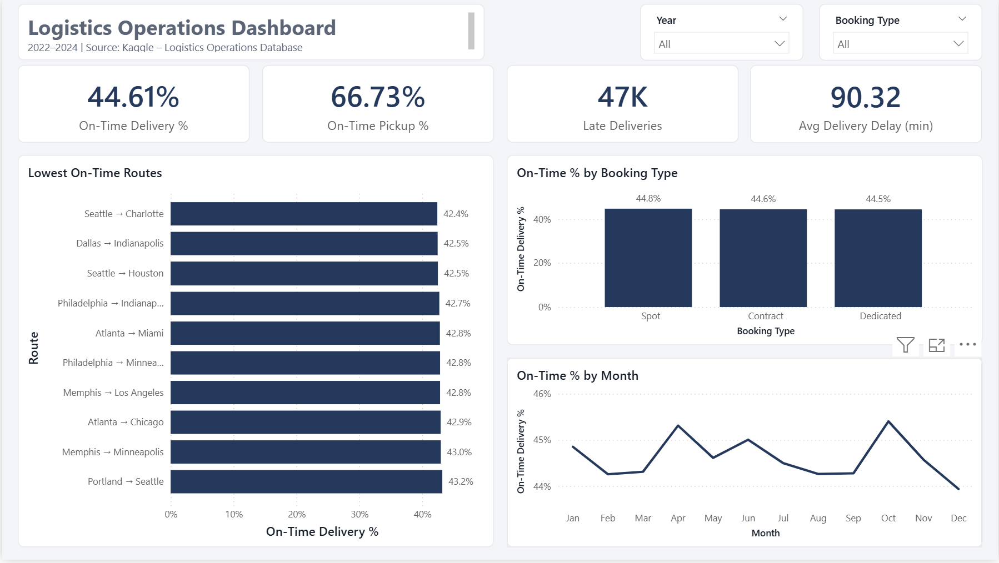
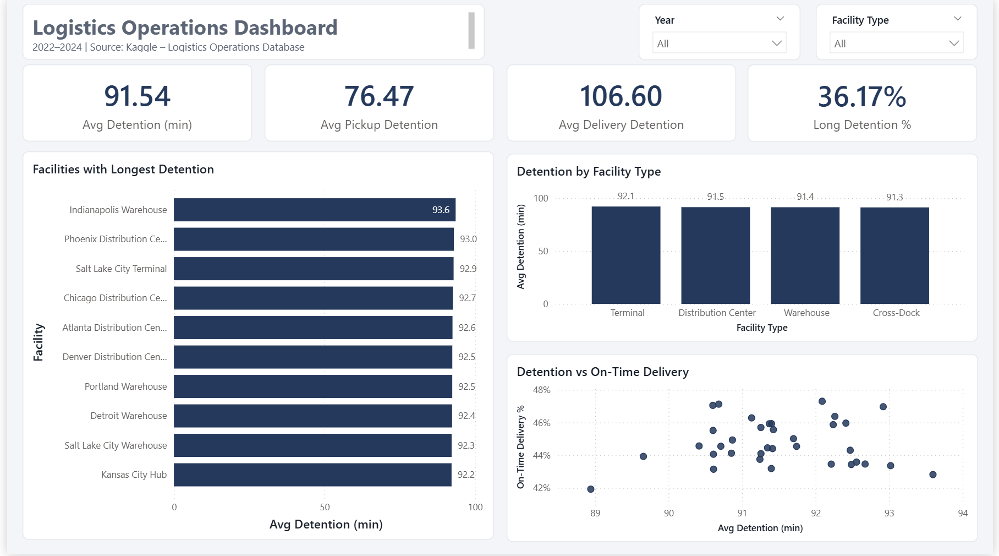
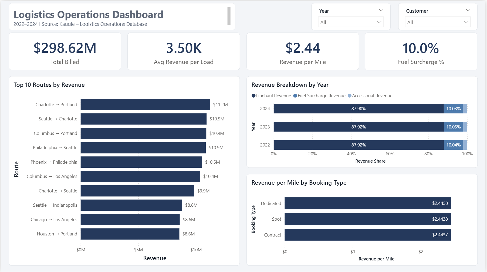

# Logistics Operations Dashboard | Power BI

An end-to-end Power BI project analyzing three years of trucking operations (2022–2024): delivery performance, facility detention, and revenue. The goal is to find where service breaks down and turn the findings into clear operational recommendations.



---

## Business Questions

1. How reliable are our pickups and deliveries, and where do delays happen?
2. Are some routes, booking types, or seasons worse than others?
3. How long do trucks wait at facilities, and does waiting cause late deliveries?
4. Where does revenue come from, and are we pricing different booking types correctly?

---

## Dataset

**Source:** [Logistics Operations Database (2022–2024)](https://www.kaggle.com/datasets/yogape/logistics-operations-database), Kaggle.
The dataset is **synthetic**: it simulates a trucking company and was created for analytics practice.

Six of the fourteen tables were used:

| Table | Rows | Description |
|---|---|---|
| `loads` | 85,410 | Shipments, booking type, and charges |
| `trips` | 85,410 | Trip execution: driver, truck, distance, duration |
| `delivery_events` | 170,820 | Pickup and delivery timestamps, detention, on-time flag |
| `customers` | 200 | Customer accounts |
| `facilities` | 50 | Warehouses, terminals, distribution centers |
| `routes` | 58 | Origin–destination lanes |

---

## Data Validation & Cleaning

The data was validated before analysis instead of being assumed correct.

| Check | Finding | Action |
|---|---|---|
| Duplicates and broken keys | None found across all six tables | No action needed |
| Missing assignments | 4,952 trips had no driver, truck, or trailer recorded | Labeled as `Unassigned` |
| Event sequence | 486 trips had delivery recorded **before** pickup | Flagged with a `Sequence Check` column and excluded from trip-time metrics, but kept in revenue |
| Data types | Numeric and date fields imported as text in three tables | Converted to correct types |
| Dataset documentation | The description claims 85–95% on-time delivery, but the data shows **44.6%** | Reported the measured figure; all KPIs are calculated directly from the event data |

**Data model:** star schema with `loads` at the center, linked to `customers`, `routes`, and `trips`, then to `delivery_events` and `facilities`, plus a DAX date table. A direct link between `delivery_events` and `loads` was removed to avoid an ambiguous filter path.



---

## Dashboard Pages

| Page | Focus | Key Metrics |
|---|---|---|
| **Overview** | Company-wide performance | Total loads, revenue, on-time pickup and delivery, detention, top 5 customers |
| **Delivery Performance** | Transportation reliability | On-time % by route, booking type, and month; average delay |
| **Facilities** | Waiting time at facilities | Detention by facility and type; detention vs. on-time |
| **Revenue & Customers** | Billing and pricing | Revenue mix, revenue per mile, top routes and customers |

### Screenshots

| Delivery Performance | Facilities | Revenue & Customers |
|---|---|---|
|  |  |  |

---

## Key Insights

### 1. Delays build up after pickup, not before it
On-time performance drops from **66.7% at pickup to 44.6% at delivery**, a gap of 22 points. Late deliveries arrive **2.7 hours late on average**. The problem starts in transit or in delivery scheduling, not at the origin.

### 2. The problem is systemic, not local
On-time delivery stays between **42.4% and 48.0% on every route**, and barely moves across years (44.5%–44.7%), load types, and booking types. No single route, customer, or season explains the delays, so fixing individual lanes would not solve it.

### 3. Detention is a cost problem, not the cause of late deliveries
Trucks wait **92 minutes on average** at each stop, and **36% of stops exceed two hours**. Delivery stops are worse than pickups (107 vs. 76 minutes). However, facilities with longer detention do not have lower on-time rates (correlation: 0.05), so waiting time and lateness need separate solutions.

### 4. Detention charges may be under-billed
Despite frequent long waits, accessorial charges, which include detention fees, make up only **2.1% of revenue**. If customers are not being billed for waits beyond the free period, this is lost revenue.

### 5. Spot loads are not priced at a premium
Revenue per mile is **$2.44 for Spot, Contract, and Dedicated loads alike**. Spot loads are usually priced higher because they are booked on short notice, so the pricing model is worth reviewing.

### 6. Revenue is stable and well diversified
Revenue holds steady at about **$99–100M per year**, with monthly revenue moving within a narrow band of **$7.5M–$8.8M** and no clear growth or decline. The largest customer contributes only **3.5%** of revenue and the top 5 together **12%**, which limits dependence on any single account.

---

## Recommendations

1. **Review delivery appointment windows.** Since lateness is consistent everywhere, the scheduled times are likely unrealistic. Compare scheduled vs. actual transit times and reset the windows.
2. **Audit detention billing.** Match stops with detention over the free period against accessorial charges to recover unbilled fees.
3. **Introduce a Spot pricing premium** and test its impact on volume.
4. **Investigate the 486 sequence errors** with the system owners to fix how events are recorded at the source.
5. **Track on-time delivery and detention monthly** as core KPIs, with targets set from this baseline.

---

## Tools & Skills

- **Power BI:** Power Query (cleaning, pivoting, merging), star-schema data modeling, DAX measures and calculated columns, multi-page report design
- **Data validation:** duplicate and key checks, event-sequence checks, comparing documentation against actual data
- **Analysis:** KPI design, root-cause thinking, turning findings into recommendations

---

## Repository Structure

```
├── Logistics_Operations_Dashboard.pbix
├── README.md
├── data/
│   ├── loads.csv
│   ├── trips.csv
│   ├── delivery_events.csv
│   ├── customers.csv
│   ├── facilities.csv
│   └── routes.csv
└── images/
    ├── overview.png
    ├── delivery_performance.png
    ├── facilities.png
    ├── revenue_customers.png
    └── model.png
```

---

**Author:** [Razan Albishri] · [LinkedIn]([your-linkedin-url](https://www.linkedin.com/in/razan-albishri))
